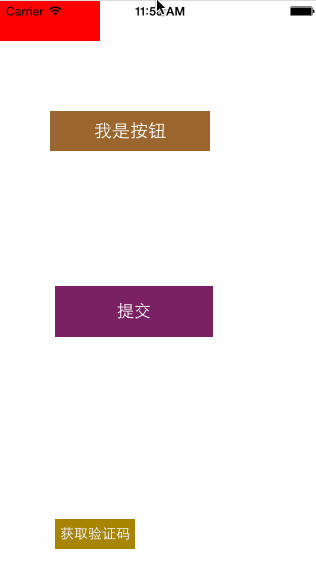

#CoreBtn
####核心按钮，让界面更专业！旨在替代一部份HUD的Btn。

  
说明 EXPLAIN
===============
个人不是很喜欢到处的HUD黑块，于是就有了CoreBtn以及CoreStatusBtn,希望你喜欢。 
成都iOS开发群： 
二群：369870753（新开，新鲜着呢，快加）  
一群：163865401（已爆满，加不上了）    

框架截图 SHOW
===============
  
 

 
##框架特性： 
>1.兼容所有ios版本。 
>2.支持代码创建、Nib创建。 
>3.高度封装，高度解耦。 
>4.可自定义动画显示与隐藏，自定义颜色，是对UIButton的扩展。 
>5.封装了很多进度以及结果类的动画。 
>6.请注意CoreBtn的设计原则是状态模式。 

  

 

-----
    CoreBtn 核心按钮，让界面更专业！如果你不知道是做什么用的，那就继续使用HUD吧。
-----

框架说明 EXPALIN
===============

        以下是一些使用示例：
        //代码
        CoreStatusBtn *btn=[[CoreStatusBtn alloc] initWithFrame:CGRectMake(50, 110, 160, 40)];
        btn.msg=@"登陆中";
        //    btn.shutOffZoomAnim = YES;
        //设置文字
        [btn setTitle:@"我是按钮" forState:UIControlStateNormal];
    
        btn.backgroundColorForNormal=[UIColor brownColor];
        btn.backgroundColorForHighlighted=[UIColor redColor];
        btn.backgroundColorForSelected=[UIColor yellowColor];
        self.btn=btn;
        
        //添加事件
        [btn addTarget:self action:@selector(btnClick:) forControlEvents:UIControlEventTouchUpInside];
       
        [self.view addSubview:btn];
        

        //nib
        self.myBtn.backgroundColorForNormal=rgb(121, 36, 98);
        self.myBtn.shutOffColorLoadingAnim = YES;
        self.myBtn.shutOffZoomAnim = YES;
        self.countBtn.backgroundColorForNormal=rgb(167, 132, 27);
        self.countBtn.countNum=60;
        
        dispatch_after(dispatch_time(DISPATCH_TIME_NOW, (int64_t)(16.0f * NSEC_PER_SEC)), dispatch_get_main_queue(), ^{
            
            self.countBtn.status=CoreCountBtnStatusNormal;
        });
        
        
        CoreBtn *btn2 = [[CoreBtn alloc] initWithFrame:CGRectMake(0, 0, 100, 40)];
        btn2.backgroundColorForNormal = [UIColor redColor];
        [self.view addSubview:btn2];
        [btn2 Click:UIControlEventTouchDown ClickBlock:^{
            NSLog(@"点击");
    }];

  

版权说明 RIGHTS
===============
本框架由成都冯成林原创，保留一切权利！

